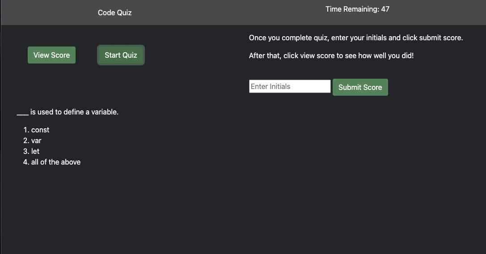

# Code Quiz

## User Story

-AS A coding boot camp student  
-I WANT to take a timed quiz on fundamentals that stores scores  
-SO THAT I can gauge my progress compared to my peers  

## Built With

-HTML  
-Bootstrap  
-JavaScript  

## Deployed Project 

-https://doolittle28.github.io/code-quiz/  

## Screenshot 

-Screenshot of deployed code quiz  

## Credits 

-https://developer.mozilla.org/en-US/  
